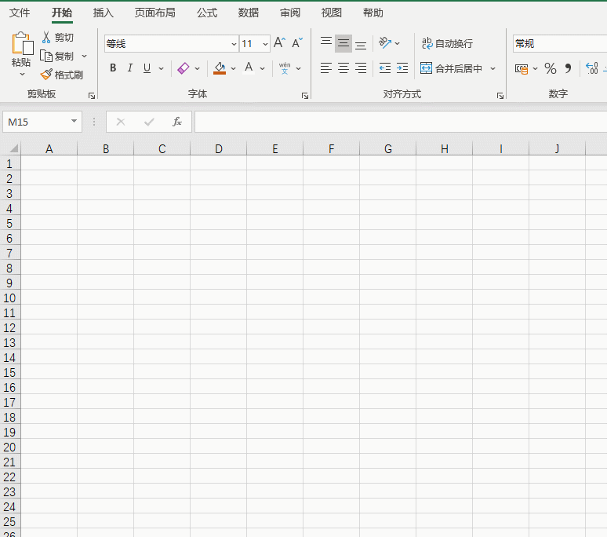
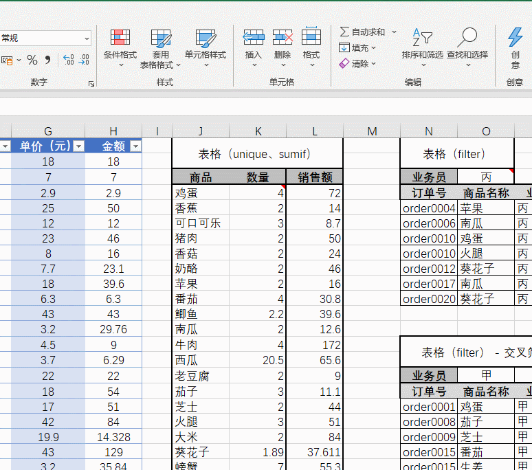
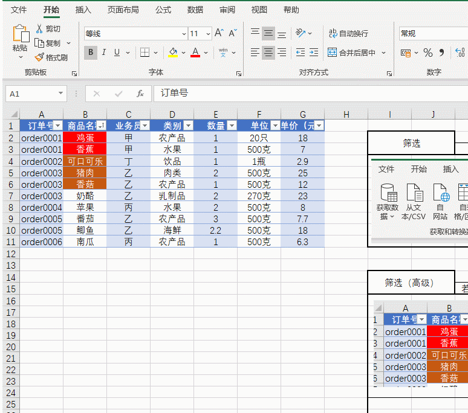
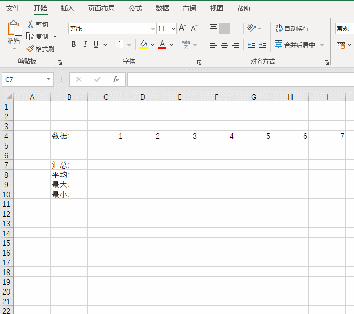
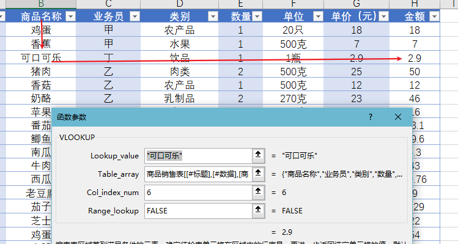
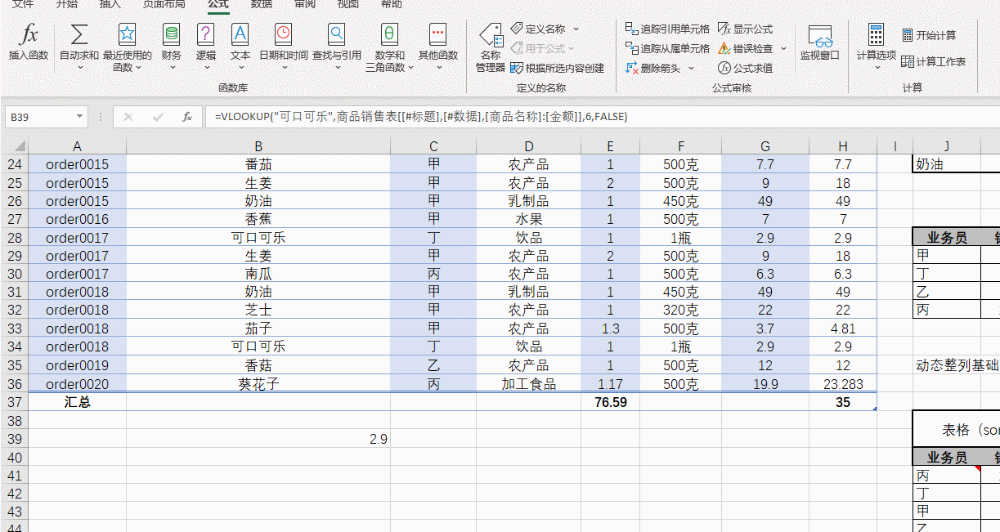
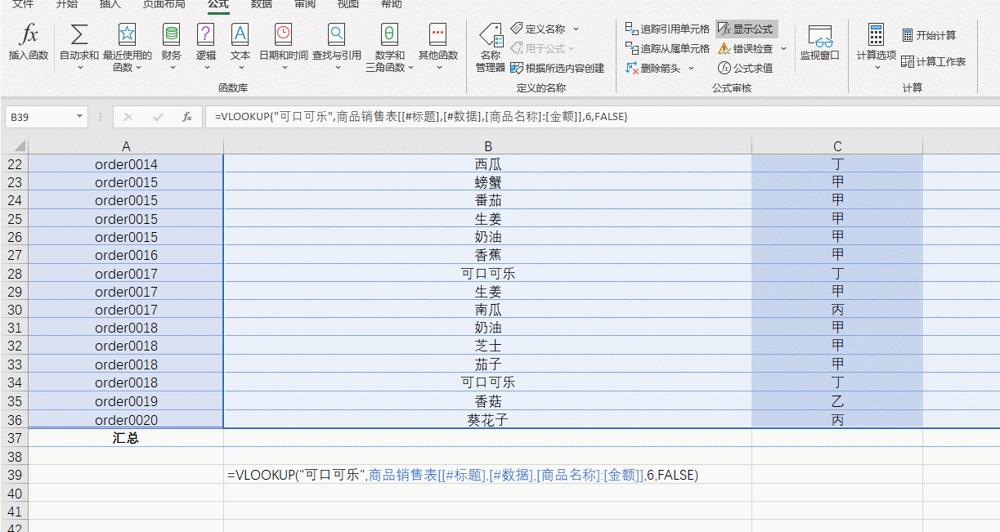
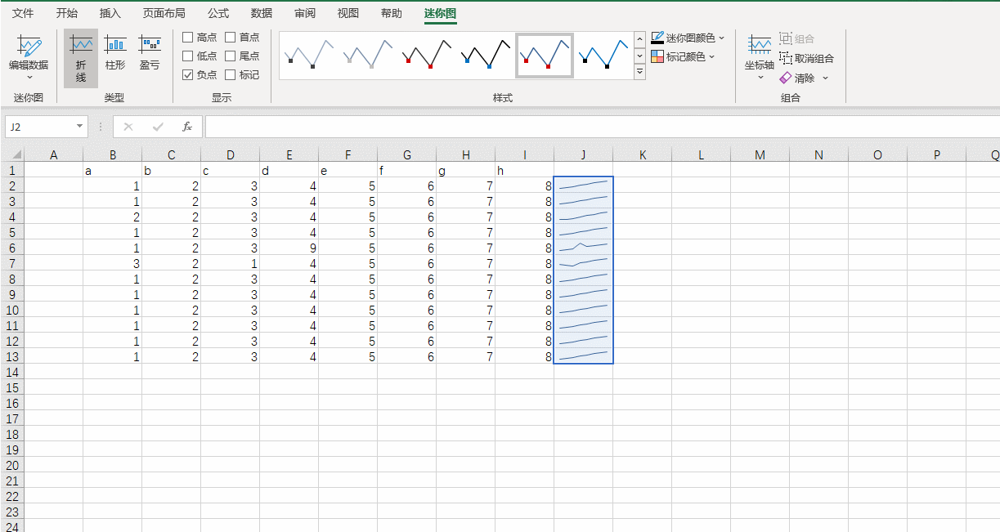
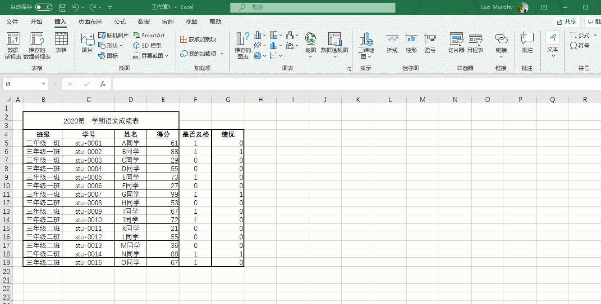

<!-- 
_paginate: false
_class: lead
_header: ''
-->

<!-- Global style -->

# 基于Excel的数据处理与分析

---

<!-- Scoped style -->

## 今天分享的内容有：

- **入门** [表格框线的绘制](./#3)，[快速定位单元格](./#4)，[数据的搜索与定位](./#5)
- **公式** [公式的基础应用](./#6)，[公式编辑器](./#7)，[公式求值](./#8)
- **分析与可视化** [如何作图](./#10)，[迷你图](./#11)，[数据透视图](./#12)
- **应用技巧** [公式编辑器](./#6)，[常用的公式](./#4)，[公式求值](./#5)
- **高级功能** [公式编辑器](./#6)，[常用的公式](./#4)，[公式求值](./#5)

--- 

## 绘制框线，可以借助快速绘制框线工具。

- 绘制边框：仅仅绘制边框；
- 绘制边框网格：绘制边框以及内部网格；
- 橡皮擦：删除所有边框；
- ……

---

## 快速定位特定类型的单元格

定位功能可以快速找到特定类型的单元格。可以定位的类型有：

- 公式
- 注释
- 空值
- ……

转到功能可以快速定位指定坐标所在的单元格。

更多内容可自行探索哦~

--- 

## 数据的搜索与定位

Excel的筛选功能非常强大，除了常用的按照单元格内容来筛选行记录外，还可以根据颜色来筛选内容哦。

相对应的，我们也可以通过单元格颜色对数据进行排序。这一点大家有空自行摸索，通过【按照颜色筛选】上方的【按照颜色排序】菜单即可实现。

--- 

## 公式的基础应用

> 用Excel的地方，就一定会用得着公式。

我们可以直接手写公式，也可以通过Excel中【插入函数】的功能，通过“填表”的方式写公式。

这里罗列了些非常有用的公式，您知道几个？

- 数值计算： sum、 count、 avg、abs、mod
- 日期处理：today、now、date、time
- 字符串： trim、 concat、textjoin、value
- 逻辑判断：if、ifna、 iferror、and、or、not 
- 查找与引用：vlookup、xlookup、hlookup

---

##  公式编辑器 - 演示案例

> 如图说是的表格中，我们要使用找到列表中第一个商品名称为“可口可乐”的交易记录“金额”数据。

假设我们用vlookup来完成这个需求。在表单中，我们可以清楚的看到vlookup所需的参数，在表单的下方，还可以看到针对参数的具体解释。

> `vlookup`函数的具体求解思路，从Table_array指定的数据区域的第一列，查找出第一个单元格内容等于Lookup_value的单元格。从找到的单元格开始，在行内往后数Col_index_num个单元格，就找到我们想要的结果了。Vlookup的求解路径像是一个英文字母【V】（如图所示），也因此得名Vlookup。

--- 

### 公式求值 - 针对复杂公式调试工具

在公式比较复杂的情况下，可以使用公式求值查看公式是怎么一步一步继续运算的。

> 可以通过步入、步出功能实现单步调试的效果。

---

### 追踪引用单元格

通过【追踪引用单元格】，可以快速找到计算结果是依赖那些数据得到的。

---

### 数据可视化

可视化说Low一点，就是作图表。Excel中关于可视化相关的功能按钮主要集中在【插入】Tab下的【图表】和【迷你图】栏目下。

--- 

### 迷你图

基础图表的部分就不做具体的演示，单的说一下迷你图。它主要的作用就是在单元格内生成图表。

Excel中要求迷你图的落成位置与数据单元格相邻。

迷你图目前支持三种类型：折线，柱形和盈亏。

---

### 数据透视图

数据透视表是一种可以快速汇总大量数据的交互式方法。可用于深入分析数值数据和回答有关数据的一些预料之外的问题。

主要针对分组求解这一类的场景。比如：

按班级计算学生的及格率，绩优率等等……

